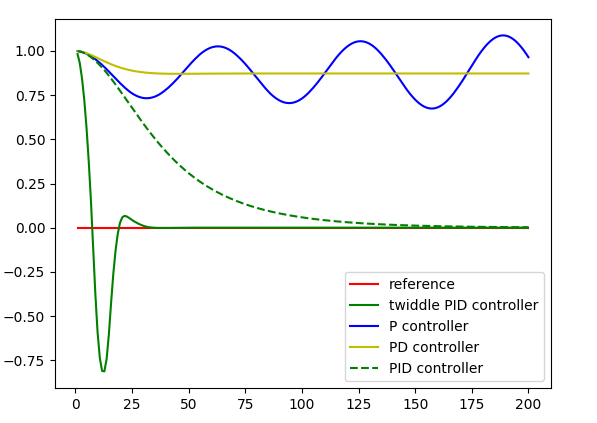

# CarND-Controls-PID
Term2-Project3: Car control using PID

The project aims to demonstrate the use of PID controllers to control the car 
navigation. The goal is to ensure the car drives at least one loop around the 
circuit in the simulator without leaving the driveable area.The simulator 
provides the CTE error (error in position of the car relative to the middle 
section of the lane) and the current speed as input. The basic logic is to use 
this CTE to compute the optimal steering angle & throttle to keep the car in 
the drivable regions and PID controller is used to compute this optimal 
steering angle and throttle value.

## PID Controller.

PID stands for propotional, integral and differential components of an entity, 
which in our case is the CTE. Because the CTE denotes the offset from the 
middle of the lane, the correction needed to return back to the middle is 
_proportional_ to the amount of CTE, i,e. correction = Kp\*cte. Ideally, we'd 
like to ensure cte-correction=0, so that the car is always at the middle of 
the lane. However, if you visualize this as a graph, you'll notice the 
osciallating pattern around cte=0 before the system stabilizes. Practially, 
this means the car deviates around the middle a lot before getting to the 
middle. And if the lane is not straight, the continuously changing cte will 
result in this continuous osciallation, and its of high amplitute, the car 
would leave the driveable area. To reduce this, we add a _differential_ 
component to our correction, i,e. correction = Kp\*cte + Kd\*cte_d where 
cte_d = [cte(t)-cte(t-1)]/dt. If we visualize this as a graph, this differential 
component smoothens the oscillations before the system stabilizes. Practially, 
this means the car will not deviate much before stabilizaing around the middle. 
However, both of these factors do not consider the initial or later offsets 
which may get introduced in the system. If we visualize as a graph, the 
proportional & differential components stabilize the curve, but doesn't 
necessarily reduce it to zero. Practially, this would mean the wouldn't wobble 
as much, but doesn't necessarily stay in the middle of lane. This might occur 
for example, due to the initial offset in the steering angle when the car is 
started. Therefore, to reduce the cte to zero we add an integral component to 
our correction which is sum of all CTEs upto time t, i,e. 
correction = Kp\*cte + Kd\*cte_d + Ki\*cte_i, where 
cte_i = cte(1) + cte(2)+...+cte(t). These three components can be visualized 
as a graph as shown below. The Kp, Kd and Ki in the equation are the hyper 
parameters that can be tuned to obtain the optimal correction required.




## Tuning Hyperparameters for PID

As described above, good PID corresponds to optimizing its hyperparams and 
how to find the optimal values for these hyperparams becomes our important 
problem. The common & the most simplest way is to arbitrarily choose some 
values and manually tweak it iteratively to obtain good values. Knowing that 
cte_i increases over time and cte_d is generally small, gives an approximate 
range of values, but needless to say this method is quite inefficient. There 
are several algorithms that help use to optimize such hyperparams and for this 
project I've implemented the twiddle algorithm that Sebastian taught us in the 
course.

Twiddle is a simple algo that tries to find the optimal values by iteratively 
increacing or decreasing the params values paritally while observing its effect 
to reduce the error as much as possible. Although this algo will converge over 
time, the fact that the simulator's road was narrow doesn't provide enough time 
for the algo to converge before going off the track. Therefore it is important 
to manually initialize the hyperparams to an acceptable good range so that 
twiddle can converge before the car leaves the track. I started with setting a 
constant throttle to 0.3 and using PID for steering angle with  all the 
hyperparams to 1. This resulted in car going in circles backward and forward 
and the correction values constantly increased to large values. This clearly 
meant the integral component was adding up to large values. So reducing the Ki 
by a factor of 10 seemed to help. After a few iterations, values in the range 
of 0.001 seemed good for Ki. Now the car wasn't goin in circles, but it started 
to oscillate a lot and eventually go off the track. This meant the differential 
component wasn't impacting the error, so increasing the Kd to around 4 showed 
considerable improvement. This was sufficient for twiddle to kick-in and 
stabilize the steering angle to keep the car on track. However, as the speed 
increased, the would go off the track as it wasn't able to steer back in time 
due to higher speed. So instead of maintaing a constant throttle, I used twiddle 
to compute the optimal throttle values as well and following the same approach 
as above, initializing with good values resulted in car being in control and 
not leaving the track. However, this also resulted in cases when the car goes 
around the circuit in reverse! Althought there isn't any criteria that say it 
shouldn't, this behaviour isn't really meaningful. Also, eventually, the 
throttle value would converge to zero to maintain cte=0 and this resulted in 
the car halting in the middle of the track without moving! This behavior is 
also theoritically correct since this state maintains cte=0. So an additional 
positive offset of 0.5 was added to the throttle to ensure the car always tries 
to move forward. With these changes, the car could drive around the track in 
forward direction without leaving the lane. Although I could stop twiddle after 
finding good hyperparms, doing so resulted in the car going off track eventually, 
for ex, after around 10 laps as slight changes in the car's orientation starts 
to accumulate after a certain point, the previously calculated hyperparam values 
wouldn't fit to dampen this accumulated error. So I've left twiddle on to run 
always so the car can drive indifinitely on the lane correctly. The different 
videos shows these behaviours.  
 

---

## Dependencies

* cmake >= 3.5
 * All OSes: [click here for installation instructions](https://cmake.org/install/)
* make >= 4.1(mac, linux), 3.81(Windows)
  * Linux: make is installed by default on most Linux distros
  * Mac: [install Xcode command line tools to get make](https://developer.apple.com/xcode/features/)
  * Windows: [Click here for installation instructions](http://gnuwin32.sourceforge.net/packages/make.htm)
* gcc/g++ >= 5.4
  * Linux: gcc / g++ is installed by default on most Linux distros
  * Mac: same deal as make - [install Xcode command line tools]((https://developer.apple.com/xcode/features/)
  * Windows: recommend using [MinGW](http://www.mingw.org/)
* [uWebSockets](https://github.com/uWebSockets/uWebSockets)
  * Run either `./install-mac.sh` or `./install-ubuntu.sh`.
  * If you install from source, checkout to commit `e94b6e1`, i.e.
    ```
    git clone https://github.com/uWebSockets/uWebSockets 
    cd uWebSockets
    git checkout e94b6e1
    ```
    Some function signatures have changed in v0.14.x. See [this PR](https://github.com/udacity/CarND-MPC-Project/pull/3) for more details.
* Simulator. You can download these from the [project intro page](https://github.com/udacity/self-driving-car-sim/releases) in the classroom.

There's an experimental patch for windows in this [PR](https://github.com/udacity/CarND-PID-Control-Project/pull/3)

## Basic Build Instructions

1. Clone this repo.
2. Make a build directory: `mkdir build && cd build`
3. Compile: `cmake .. && make`
4. Run it: `./pid`. 

Tips for setting up your environment can be found [here](https://classroom.udacity.com/nanodegrees/nd013/parts/40f38239-66b6-46ec-ae68-03afd8a601c8/modules/0949fca6-b379-42af-a919-ee50aa304e6a/lessons/f758c44c-5e40-4e01-93b5-1a82aa4e044f/concepts/23d376c7-0195-4276-bdf0-e02f1f3c665d)

